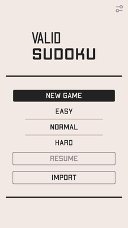
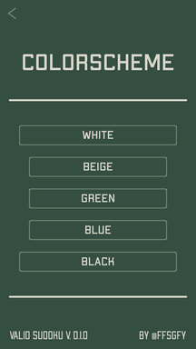
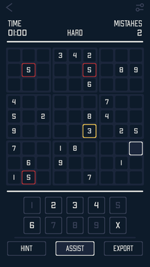
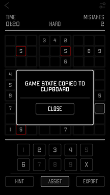

# Valid Sudoku

A simple and minimal sudoku app implemented in Python using [Kivy](https://github.com/kivy/kivy).
Targets Android and Linux, and can probably be made to work on other platforms supported by the framework.

## Running on Linux

On Linux the app can be run directly from the [main](./main.py) file:

```sh
# Install the dependencies
pip install kivy cython
# Compile the solver
pip install ./vsext
# Run the app
python main.py
```

**Note**: the latest stable release of Kivy (`2.1.0`) does not support Python `>= 3.11`.

## Building for Android

An Android distribution can be built using [buildozer](https://github.com/kivy/buildozer)
from the included [spec](./buildozer.spec) file.
The following commands were tested on Ubuntu `22.04` (running inside a Docker container):

```sh
# Install buildozer and its dependencies
apt install git zip unzip openjdk-17-jdk python3-pip autoconf libtool pkg-config zlib1g-dev \
    libncurses5-dev libncursesw5-dev libtinfo5 cmake libffi-dev libssl-dev
pip install buildozer cython
# Clone this repo
git clone https://github.com/ffsgfy/valid-sudoku && cd valid-sudoku
# Start the build
buildozer android debug
```

This produces an `.apk` file in the `bin/` subdirectory.

## Screenshots

[](./images/screenshot-1.png)
[](./images/screenshot-2.png)
[](./images/screenshot-3.png)
[](./images/screenshot-4.png)
[](./images/screenshot-5.png)

